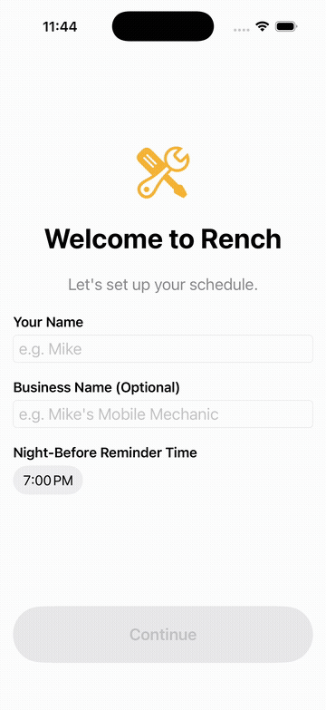

# Rench

A hands-free appointment scheduler for mechanics and independent service techs, built with
SwiftUI, SwiftData, WidgetKit, and App Intents (Siri/Shortcuts).

<p align="center">
  
</p>

<p align="center">
  <a href="docs/demo.mp4">Higher-quality MP4 version</a>
</p>

## Requirements

- Xcode 16+ (built/tested with Xcode 26, iOS 17.0 minimum deployment target)
- [XcodeGen](https://github.com/yonaskolb/XcodeGen) (`brew install xcodegen`) — the `.xcodeproj`
  is generated from `project.yml`, not hand-edited or committed as source of truth

> **Note on iOS version:** the original brief asked for iOS 16+, but SwiftData (required for
> local persistence + CloudKit sync) is an iOS 17+-only framework, so the deployment target here
> is iOS 17.0.

## Getting started

```bash
xcodegen generate
open Rench.xcodeproj
```

Build and run the `Rench` scheme on an iPhone simulator or device.

## Running on your own iPhone

1. **Plug your iPhone into your Mac** (a cable is the most reliable route the first time; once
   trusted, Xcode can also deploy over the same Wi-Fi network).
2. **Add your Apple ID to Xcode**, if you haven't already: Xcode menu → Settings → Accounts →
   `+` → sign in. A free, non-paid Apple ID is enough to run your own app on your own device —
   you only need a paid Apple Developer Program account for CloudKit (see below) or for
   distributing the app to others.
3. **Select your phone as the run destination**: in the toolbar at the top of the Xcode window,
   click the device dropdown (next to the scheme name) and pick your iPhone from the list
   instead of a simulator.
4. **Set your Team**: click the blue "Rench" project icon at the top of the file list → select
   the **Rench** target → **Signing & Capabilities** tab → set **Team** to your Apple ID. Repeat
   for the **RenchWidgetExtension** target (same Team). Xcode will generate a free provisioning
   profile automatically — this is why the iCloud/CloudKit capability was deliberately left out
   of the default entitlements (see below): a free Apple ID can't provision that capability, and
   leaving it in would make this step fail.
5. **Press Run (▶)**. The first time, your iPhone will refuse to open the app and show
   "Untrusted Developer" — go to **Settings → General → VPN & Device Management** on the phone,
   tap your Apple ID under "Developer App", and tap **Trust**. Run again from Xcode.
6. The app installs and launches for real. A free Apple ID's signature expires after **7 days**,
   so you'll need to re-run from Xcode weekly to keep using it (a paid account signs for a year).

Once it's installed on your phone:
- **Widget**: long-press the Home Screen → tap **+** → search "Rench" → add the widget.
- **Siri**: say "Hey Siri, ask Rench what's on my schedule" (or any of the phrases in the app's
  Settings → Siri & Shortcuts screen). You can also open the **Shortcuts** app, find Rench's
  shortcuts under **My Shortcuts**, and run them by tapping instead of speaking — useful for
  testing without saying a phrase out loud. Voice testing doesn't work in the iOS Simulator, so
  this is the one thing you can only verify on a real device.
- **Notifications**: background the app (don't force-quit it) and wait for a scheduled
  night-before or prior reminder to fire, or add a test appointment a couple of minutes out to
  see the "prior reminder" arrive quickly.

## CloudKit sync — currently OFF by default

The app ships with `PersistenceController.cloudKitSyncEnabled = false`
([Shared/Services/PersistenceController.swift](Shared/Services/PersistenceController.swift)),
and the iCloud/CloudKit capability is deliberately omitted from `project.yml`'s entitlements —
only App Groups is there (needed for the widget to read the same local store). All the
SwiftData + CloudKit plumbing itself is written and ready
(`ModelConfiguration(cloudKitDatabase: .private(...))` in `PersistenceController`), just not
wired into the shipped entitlements yet. To turn it on, once you have a **paid** Apple Developer
Program account:

1. In `project.yml`, uncomment/add to **both** the `Rench` and `RenchWidgetExtension` targets'
   `entitlements.properties`:
   ```yaml
   com.apple.developer.icloud-services:
     - CloudKit
   com.apple.developer.icloud-container-identifiers:
     - iCloud.com.rench.app
   ```
   (project.yml already has the exact snippet commented above each target's `entitlements:` key.)
2. Run `xcodegen generate` again to regenerate the `.xcodeproj` with the new entitlements.
   *(Don't add the capability via Xcode's Signing & Capabilities UI instead — XcodeGen
   regenerates the entitlements file from `project.yml` on every `xcodegen generate`, which
   would silently wipe out a change made only in Xcode.)*
3. In Xcode, Signing & Capabilities for both targets: set **Team** to your paid account, and
   confirm/create the `iCloud.com.rench.app` container when prompted.
4. Flip `cloudKitSyncEnabled` to `true` in `PersistenceController.swift` and rebuild.

**Why not auto-detect this at runtime?** When the iCloud entitlement isn't genuinely present,
SwiftData's CloudKit mirroring doesn't fail gracefully — it can crash the process from a
background queue deep inside Core Data's `NSCloudKitMirroringDelegate`, *after*
`ModelContainer` init has already returned successfully. A `try?`/`catch` around container
creation can't intercept that. So this is a deliberate build-time switch rather than a
best-effort runtime fallback. Until you flip it, the app works fully offline on local SwiftData
storage — nothing else about the app depends on CloudKit being on.

## Project layout

- `Shared/` — compiled into all three targets: the `Appointment` SwiftData model, App Group /
  settings storage, the persistence controller, and `NotificationContentBuilder` (pure,
  unit-tested sentence + trigger-date logic used by notifications, the widget, and Siri).
- `Rench/` — the app target: views, onboarding, settings, the notification scheduler
  (`UNUserNotificationCenter` wrapper), and the App Intents (Siri/Shortcuts).
- `RenchWidget/` — the WidgetKit extension (Home Screen + Lock Screen "next appointment" widget).
- `RenchTests/` — logic-only unit tests (no host app) for the notification/scheduling logic.

## Tests

```bash
xcodebuild -project Rench.xcodeproj -scheme Rench \
  -destination 'platform=iOS Simulator,name=iPhone 17 Pro' \
  test -only-testing:RenchTests
```

## App icon

`Rench/Assets.xcassets/AppIcon.appiconset/icon-1024.png` is a placeholder wrench mark — swap it
for real branding whenever you're ready (Xcode's single-size app icon feature means you only
need to replace that one 1024×1024 PNG).
